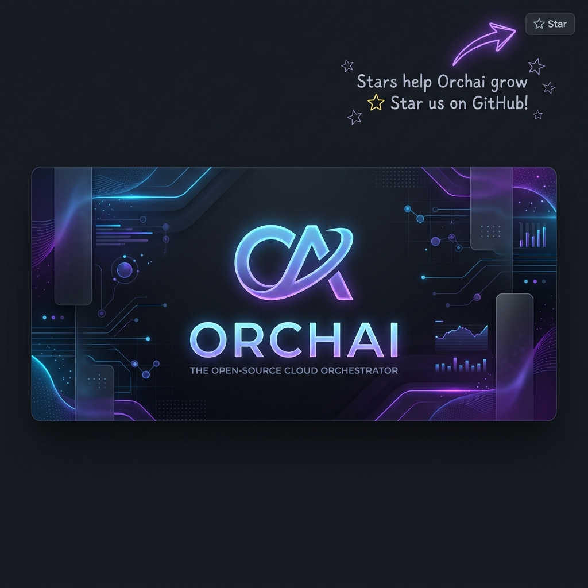

<div align="center">




## Klydis - The premier orchestration wrapper to reduce attention rot and maximize development throughput!

</div>

**KLYDIS** is an Orchestration Wrapper focused on reducing attention rot and throughput decay. It provides a robust, native desktop experience on Windows using Electron and a Python backend. It acts as an autonomous and collaborative agent orchestration application to help users efficiently solve complex development and computing problems.

## 🚀 Key Features

- **Real-time Chat**: Bidirectional WebSocket communication between the Electron frontend and FastAPI backend for lightning-fast responses.
- **Agent Orchestration**: Integrated tool execution (`read_file`, `write_file`, `list_directory`, `run_command`, `research_topic`) allowing the AI to safely interact with the host system via an interactive approval-based sandboxing loop.
- **Cognitive World State**: Asynchronous BM25 index and memory consolidation to maintain context over long-running sessions. The engine tracks and merges internal reasoning segments across multi-step tool iterations.
- **Sensory Processing**:
  - **Local Audio Transcriber**: Built-in fully local `faster-whisper` model for processing raw PCM bytes natively without requiring `ffmpeg`.
  - **Screen Watcher Integration**: Automated screen monitoring that scales screenshots to 1024x1024 and routes them to a Vision LLM (`llava`) to allow the agent to continuously "see" and understand the desktop context.
- **Strict Modularity**: Built like LEGO bricks. Each UI component is isolated in its own `.ts`/`.tsx` file with an accompanying, separate `.css` stylesheet, completely eliminating inline styles.

## 🏗️ Core Architecture

KLYDIS is built with a dual-stack architecture designed for performance and maintainability:

- **Frontend**: A React + TypeScript UI built with Vite and packaged as a Windows native desktop application using Electron.
- **Backend**: A Python FastAPI server handling orchestration logic, memory consolidation, system tool execution, and real-time WebSocket communication.
- **Sensory Input**: Background threads managing speech-to-text and automated screen monitoring via a new `/world-state/sensory` REST endpoint.

## 🛠️ Getting Started

### Prerequisites

- [Node.js](https://nodejs.org/) (v18+)
- [Python](https://www.python.org/) (3.10+)
- [Ollama](https://ollama.com/) (installed locally for Vision and chronological thinking)

### Installation & Running

The easiest way to start the entire application (both frontend and backend) on Windows is using the provided batch script:

```bash
git clone https://github.com/obsidian-pixel-backup/KLYDIS.git
cd KLYDIS
.\start.bat
```

**To run the components manually for development:**

1. **Start the Backend:**
   ```bash
   cd backend
   pip install -r requirements.txt
   python -m uvicorn main:app --host 127.0.0.1 --port 8000 --reload
   ```

2. **Start the Frontend:**
   ```bash
   cd frontend
   npm install
   npm run electron:dev
   ```

## 🧪 Development & Testing

- **Backend Tests:** Python backend tests can be run from the root directory using pytest.
  ```bash
  python -m pytest test_*.py -v
  ```
- **Electron Testing:** To test the electron setup locally:
  ```bash
  node test_electron.cjs
  ```

For more in-depth details on developing within the project, our development workflow, and internal standards, please see [CLAUDE.md](CLAUDE.md) and [project_instructions.md](project_instructions.md).

## 🗺️ Product Roadmap

We are constantly pushing the boundaries of what local AI orchestration can achieve. Here is a glimpse into our roadmap:

- **Live Vision Agent Mode**: Real-time, human-like interaction integrating WebRTC for low-latency streaming of screen/camera.
- **Sub-agent Delegation**: Full hierarchy and orchestration for specialized tasks, allowing the primary orchestrator to spawn and instruct specialized sub-agents.
- **Planner Mode & Artifact Manager**: Multi-stage reasoning loops generating structured markdown implementation plans, alongside a centralized UI to manage generated documents and code diffs.
- **MCP Server Integration**: Seamless discovery and connection to external Model Context Protocol (MCP) servers to expand the agent's toolset.

## 🤝 Contributing

We welcome contributions from the community! Please read our [Contributing Guide](CONTRIBUTING.md) to understand how to submit bugs, suggest enhancements, and create pull requests. Ensure you also review our [Code of Conduct](CODE_OF_CONDUCT.md).

## 📄 License

This project is licensed under the MIT License - see the [LICENSE](LICENSE) file for details.
